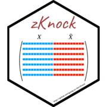

# zKnock 

[](https://github.com/guang-yu-zhu/zKnock)
[](https://opensource.org/licenses/MIT/)
[](https://lifecycle.r-lib.org/articles/stages.html)
[](https://CRAN.R-project.org/)

## Installation

```R
devtools::install_github('guang-yu-zhu/zKnock')
```

## Package

